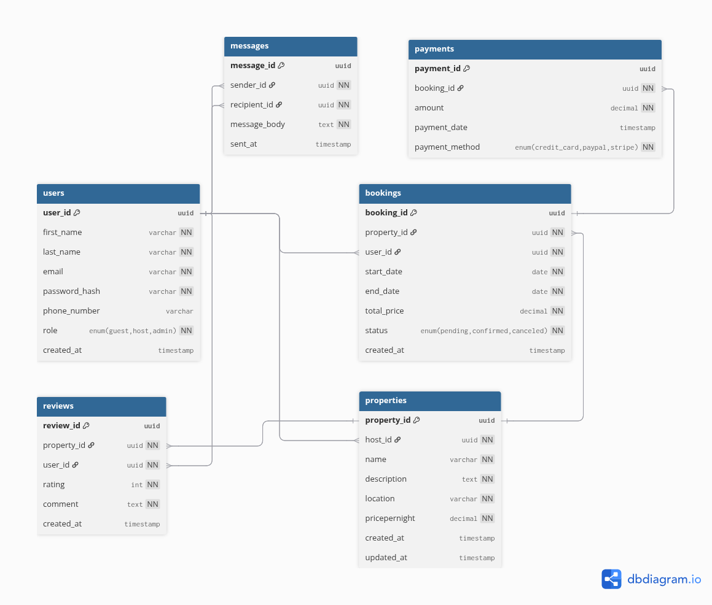

# Airbnb Database — ERD Requirements

## Step 1 — Entities & Attributes

### 1. User
| Attribute | Notes |
|---|---|
| user_id | PK, UUID |
| first_name |  |
| last_name |  |
| email | Unique |
| password_hash |  |
| phone_number |  |
| role | Enum: guest, host, admin |
| created_at | Timestamp |

### 2. Property
| Attribute | Notes |
|---|---|
| property_id | PK, UUID |
| host_id | FK → User.user_id |
| name |  |
| description |  |
| location |  |
| pricepernight | Decimal / numeric |
| created_at | Timestamp |
| updated_at | Timestamp |

### 3. Booking
| Attribute | Notes |
|---|---|
| booking_id | PK, UUID |
| property_id | FK → Property.property_id |
| user_id | FK → User.user_id |
| start_date | Date |
| end_date | Date |
| total_price | Decimal / numeric |
| status | Enum: pending, confirmed, canceled |
| created_at | Timestamp |

### 4. Payment
| Attribute | Notes |
|---|---|
| payment_id | PK, UUID |
| booking_id | FK → Booking.booking_id |
| amount | Decimal / numeric |
| payment_date | Timestamp |
| payment_method | Enum: credit_card, paypal, stripe |

### 5. Review
| Attribute | Notes |
|---|---|
| review_id | PK, UUID |
| property_id | FK → Property.property_id |
| user_id | FK → User.user_id |
| rating | Integer (1–5) |
| comment | Text |
| created_at | Timestamp |

### 6. Message
| Attribute | Notes |
|---|---|
| message_id | PK, UUID |
| sender_id | FK → User.user_id |
| recipient_id | FK → User.user_id |
| message_body | Text |
| sent_at | Timestamp |

---

## Step 2 — Relationships (Cardinality)

- User → Property: One-to-Many (1 host can have many properties)  
- User → Booking: One-to-Many (1 user can have many bookings)  
- Property → Booking: One-to-Many (1 property can have many bookings)  
- Booking → Payment: One-to-One (each booking has one payment)  
- User → Review: One-to-Many (1 user can write many reviews)  
- Property → Review: One-to-Many (1 property can have many reviews)  
- User → Message: One-to-Many for sender and recipient (users can send and receive many messages)
---

## Step 3 — Create Visual using (https://dbdiagram.io/d) 
- **[Diagram Script](https://dbdiagram.io/d/68fd226f357668b7329a6af8)**
- Local Diagram Script **[Local Script](bdscripts.sql)**

1) Open https://dbdiagram.io/d
2) Click “New Diagram” → Name it **Airbnb_ERD**.
3) Copy your dbdiagram.io script (entities and attributes with PKs/FKs) into the editor.
4) dbdiagram.io will automatically generate rectangles for entities and lines for relationships.
5) Define relationships using Ref: syntax for One-to-Many or One-to-One.

Example:
```sql
Ref: users.user_id < properties.host_id
Ref: bookings.booking_id < payments.booking_id
```

Optionally, use colors and notes for better readability.

Example:

```sql
Table users {
  user_id uuid [pk, unique, note: "Primary Key"]
} [note: "User entity", color: "#blue"]
```
