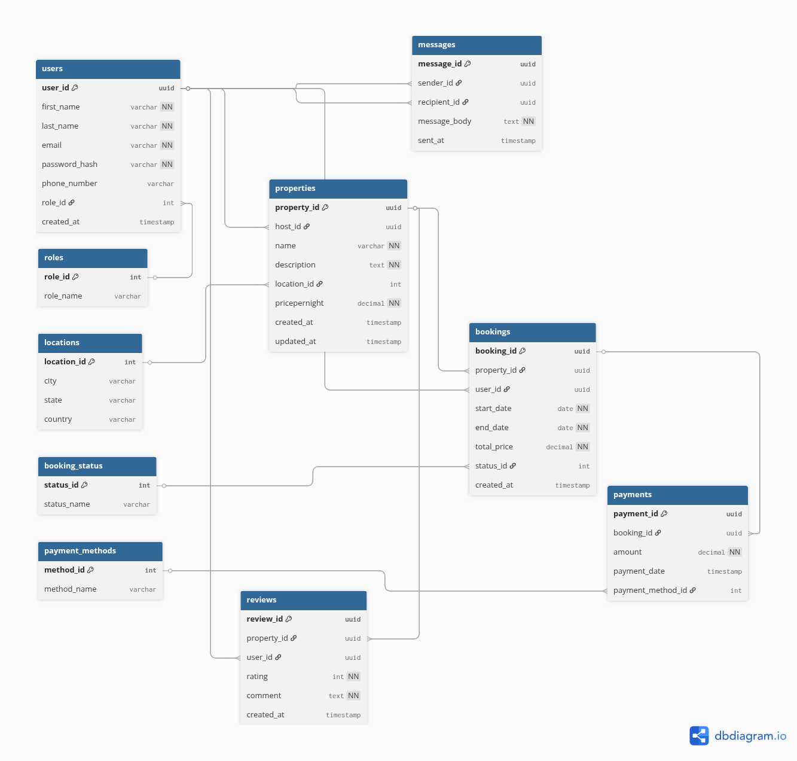

# Database Normalization — Airbnb Clone

## Objective
Apply normalization principles to ensure the schema is in Third Normal Form (3NF): reduce redundancy, maintain data integrity, and support efficient queries.

## Current Schema
- User (user_id, first_name, last_name, email, password_hash, phone_number, role, created_at)  
- Property (property_id, host_id, name, description, location, pricepernight, created_at, updated_at)  
- Booking (booking_id, property_id, user_id, start_date, end_date, total_price, status, created_at)  
- Payment (payment_id, booking_id, amount, payment_date, payment_method)  
- Review (review_id, property_id, user_id, rating, comment, created_at)  
- Message (message_id, sender_id, recipient_id, message_body, sent_at)

## Redundancy Check
- Property price and location stored only in Property — no redundancy. ✅  
- User roles and payment methods implemented as enums — normalized for current scope. ✅  
- booking.total_price can be derived from pricepernight × nights; storing it is acceptable for performance but should be kept consistent. ⚠️

## Normal Form Verification
- 1NF — All attributes are atomic; no repeating groups. ✅  
- 2NF — All non-key attributes fully depend on their table's primary key. ✅  
- 3NF — No transitive dependencies; non-key attributes depend only on the primary key. ✅

Examples:
- User.email depends only on user_id.  
- Payment.amount depends only on payment_id, not on booking.property_id.

## Optional Refinements
- Add a PaymentMethod table if supported methods will expand (id, name, provider_data).  
- Extract Location into a PropertyLocation table if locations gain attributes (city, country, coordinates).  
- Consider storing nightly_rate_history if property pricing changes frequently and historical pricing is needed.  
- Add constraints/triggers to keep booking.total_price consistent with property.pricepernight.

## Conclusion
The current schema meets 3NF for the described requirements. Minor refinements (separate lookup tables, historical pricing) may improve flexibility and auditability depending on future needs.

# Database Normalization — Airbnb Clone (3NF)

## Objective
Apply full Third Normal Form (3NF): remove transitive dependencies, separate repeated or multi-valued data, and ensure each non-key attribute depends only on the primary key.

## Normalized Tables (3NF)

1. Users
- user_id (PK, UUID)  
- first_name  
- last_name  
- email (Unique)  
- password_hash  
- phone_number  
- role_id (FK → Roles.role_id)  
- created_at

2. Roles
- role_id (PK)  
- role_name (guest, host, admin)

3. Properties
- property_id (PK, UUID)  
- host_id (FK → Users.user_id)  
- name  
- description  
- location_id (FK → Locations.location_id)  
- pricepernight  
- created_at  
- updated_at

4. Locations
- location_id (PK)  
- city  
- state  
- country

5. Bookings
- booking_id (PK, UUID)  
- property_id (FK → Properties.property_id)  
- user_id (FK → Users.user_id)  
- start_date  
- end_date  
- total_price  
- status_id (FK → BookingStatus.status_id)  
- created_at

6. BookingStatus
- status_id (PK)  
- status_name (pending, confirmed, canceled)

7. Payments
- payment_id (PK, UUID)  
- booking_id (FK → Bookings.booking_id)  
- amount  
- payment_date  
- payment_method_id (FK → PaymentMethods.method_id)

8. PaymentMethods
- method_id (PK)  
- method_name (credit_card, paypal, stripe)

9. Reviews
- review_id (PK, UUID)  
- property_id (FK → Properties.property_id)  
- user_id (FK → Users.user_id)  
- rating (1–5)  
- comment  
- created_at

10. Messages
- message_id (PK, UUID)  
- sender_id (FK → Users.user_id)  
- recipient_id (FK → Users.user_id)  
- message_body  
- sent_at

## 3NF Improvements Explained
- Roles separated to avoid repeating role values in Users.  
- Locations extracted to avoid repeating city/state/country across Properties.  
- BookingStatus extracted to avoid repeating status values in Bookings.  
- PaymentMethods extracted to avoid repeating payment method values in Payments.  
- All non-key attributes depend solely on their table's primary key; transitive dependencies